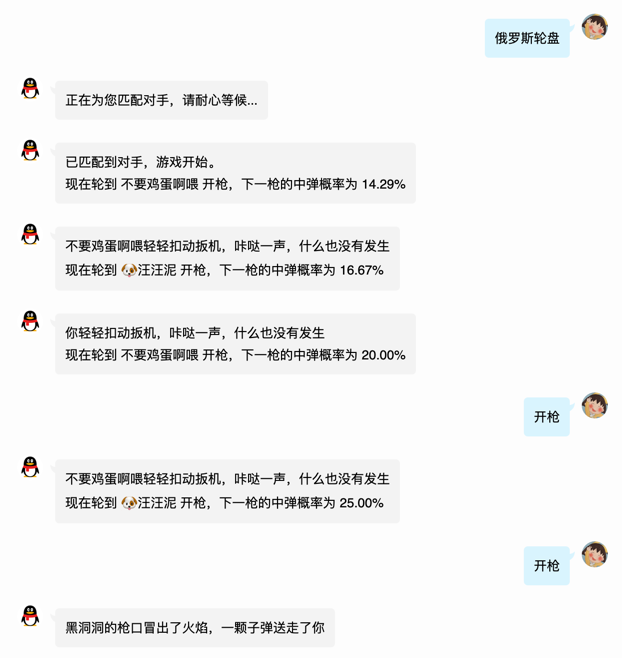

# go.gambler

一个基于 go-cqhttp 的俄罗斯转盘小游戏

## 版本信息

- cq-http: [1.0.0-rc1](https://github.com/Mrs4s/go-cqhttp/releases/tag/v1.0.0-rc1)
- go: 1.17

## 说明

指令集：
- 俄罗斯轮盘：开启新的游戏，私聊为双人匹配，群聊为多人游戏（还没做）。
- 开枪：房主先开枪，轮到谁，谁就应该发「开枪」指令，会得到是否中弹的提示。
- 接受挑战：群聊功能，指在群聊中加入游戏（还没做）。

